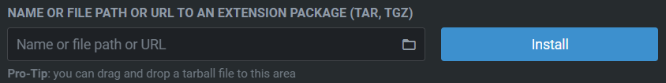

# Things to do after fresh installation

## Install Git first

```shell
winget install -e --id Git.Git --source winget --accept-source-agreements --accept-package-agreements
```

## Install other Winget packages

A list of packages is maintained in `winget-packages.list` file.

Currently, the following applications are installed via `winget`:

- `dbeaver.dbeaver` - Open-source database management UI,
- `Ditto.Ditto` - clipboard manager,
- `Git.Git` - Git for Windows,
- `Google.Chrome`,
- `Jetbrains.Toolbox` - utility to install JetBrains products,
- `Kubernetes.kubectl` - `kubectl` utility,
- `Microsoft.PowerToys` - goodies from Microsoft (https://learn.microsoft.com/en-us/windows/powertoys/),
- `Microsoft.WindowsTerminal`,
- `MuhammedKalkan.OpenLens` - Kubernetes UI,
- `Notepad++.Notepad++`
- `Obsidian.Obsidian` - local-first note taking tool.

## How to install

- Elevate your privileges via `Heimdall Thor Agent`,
- Run `Git Bash` as administrator,
- Execute the script: 
## Install Citrix Workspace

From here: https://www.citrix.com/downloads/workspace-app/windows/workspace-app-for-windows-latest.html

## Add entries to KiTTY for databases

```text
# db03 (test01)
Source:      127.129.69.33:5432
Destination: 10.129.69.33:5432
```

In `Connection -> SSH -> Tunnels` after `jump-netcompany` connection is chosen.

## Add entry to `/etc/hosts` for DMS project

```text
127.129.0.1         kubernetes
```

In order to have connection to Kubernetes cluster from local.

# Install OpenLens plugins that are useful

List of plugins:

```
@andrea-falco/lens-multi-pod-logs
@alebcay/openlens-node-pod-menu
```

They can be installed by going to `File -> Extensions` or pressing `Ctrl-Shift-E`.


